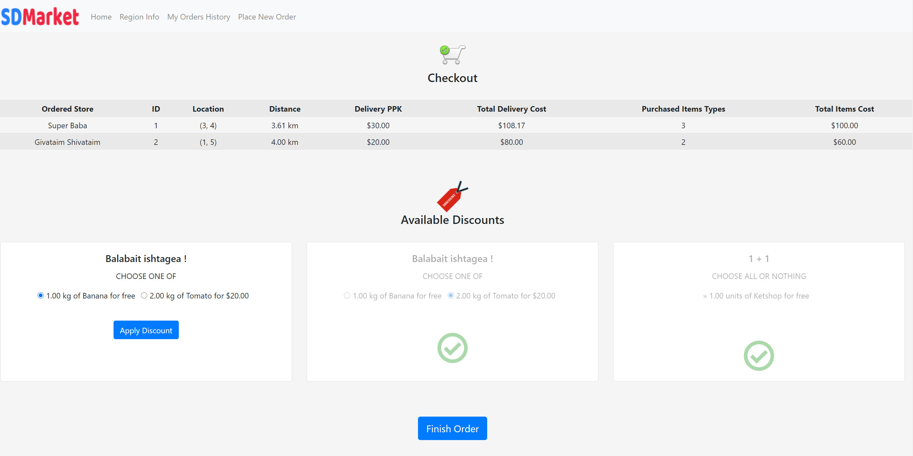

  

# SDMarket
SDMarket is a Java-based wise consumption web application running on the Apache Tomcat server, developed using the following technologies:
 
`Java` `Apache Tomcat` `XML` `JSON` `JavaScript` `AJAX` `jQuery` `Bootstrap` `HTML5` `CSS`

# About
The development of the world and technology makes it possible to bring together store owners and consumers and create a digital arena in which the consumer can, on the one hand, make quick and easy price comparisons, and on the other hand, generate exposure of stores to different consumers.

SDMarket is a web application that offers users a convenient platform for purchasing items from stores across the network while performing the ideal price comparison according to the consumer's requirements.

Users who own stores in a particular area will be able to formulate the information about their stores, discount offers, and items that they sell in the app's XML file, upload it to the website, thus making it available to potential customers.
This way, casual customers in the area will be able to purchase items from it cheaply and faithfully.
At the same time, in order not to encourage monopolies, we will also allow other store owners to open stores in a particular area and thus "compete" with the original store owners in supplying cheap items.

# Requirements
* Java Runtime Environment/Java Development Kit installed on the computer

# Getting Started
1. Clone/fork the repository or download the project.
2. Extract the `apache-tomcat-9.0.39.zip` file.
3. Put the `sd-market.war` file inside `apache-tomcat-9.0.39\webapps` folder.
4. Go to the `apache-tomcat-9.0.39\bin` folder and run the `startup.bat` file.
5. Finally, navigate to `https://localhost:8080/sd-market` in your favorite browser.

 

# Main Features
- [x] Creating user accounts
- [x] Loading data from XML file uploaded
- [x] Placing orders
- [x] Applying discounts
- [x] Giving feedback
- [x] Executing transactions
- [x] Receiving notifications about various events
- [x] Live chat with other online users
- [x] Managing data of stores and items
- [x] Viewing orders history

# Preview Some Pages in the App
#### Signup page

#### Home page

#### New notification

#### Feedbacks page

#### Checkout page

#### Account page

#### Chat page

